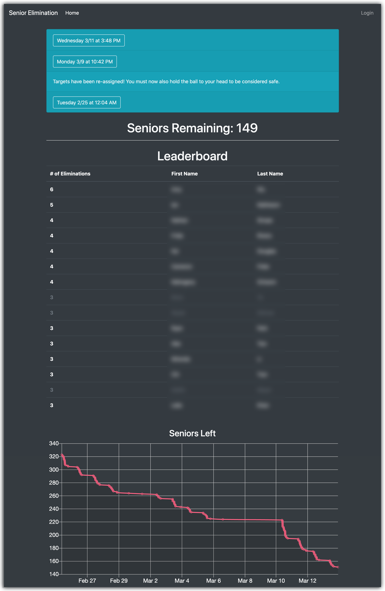

# Senior Elimination Website

### Overview

My high school has a minigame that almost all seniors play near the end of the school year. Each player is assigned a target to "eliminate," sort of like a game of tag.

This website:
* Assigns everyone playing a unique ID and login
* Has an interface for submitting an elimination
* Displays a homepage showing current statistics about the game

### Stack

Django backend, Jinja2 + Bootstrap, Heroku for hosting

### Screenshot

